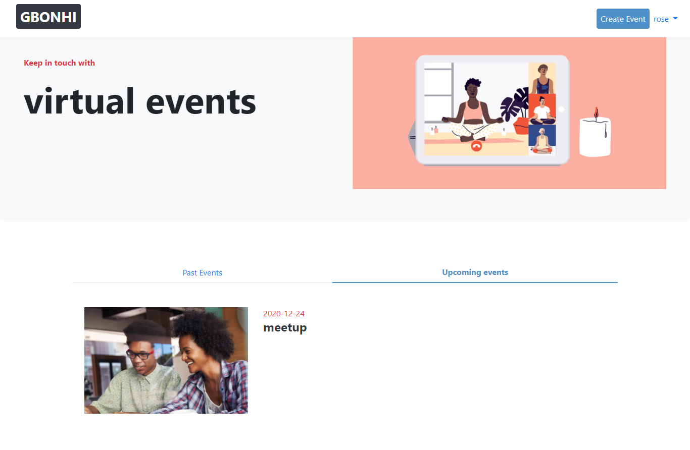

# private-events
We had to build a site similar to a private Eventbrite which allows users to create events and then manage user signups. Users can create events and send invitations and parties (sound familiar?). Events take place at a specific date and at a location (which you can just store as a string, like “Andy’s House”).

A user can create events. A user can attend many events. An event can be attended by many users.

## Project screenshot


## 🔨 Built in

- Ruby on Rails 6.0.3
- Bootstrap 4

## 🚀 Our Project

Our project can be found at https://github.com/AkintoyeOlamide/members-only

## Live Demo

You can find the demo [here](https://damp-gorge-07639.herokuapp.com/)

## Gems used

- [shoulda matchers](https://github.com/thoughtbot/shoulda-matchers)
```
group :development, :test do
  gem "database_cleaner"
  gem "rspec-rails"
  gem 'shoulda-matchers'
  gem 'rack_session_access'
end

group :test do
  gem "capybara", '>= 2.15'
  gem "selenium-webdriver"
end

```

## To run the project in local

- clone the repository from here [repo link](https://github.com/daviidy/private-events)
- Open terminal and navigate to root folder (/private-events).
- Once in root folder
  - type: `rails s` in terminal and in browser
  - run `bundle install`, `rails db:create`, and `rails db:migrate`
  - type localhost:3000/ in address bar.

## How to run the test suite

We added validations and associations tests for User, Event and Attendance models.
We added also integration tests for authentication and event creation
Run these tests with those commands:

### unit tests
- `rspec spec/user_spec.rb`
- `rspec spec/event_spec.rb`
- `rspec spec/attendance_spec.rb`

### integration tests
- `rspec spec/features/authenticate_user_spec.rb`
- `rspec spec/features/create_event_spec.rb`

- add this to your Gemfile
```
group :development, :test do
  gem "database_cleaner"
  gem "rspec-rails"
  gem 'shoulda-matchers'
  gem 'rack_session_access'
end

group :test do
  gem "capybara", '>= 2.15'
  gem "selenium-webdriver"
end

```
- run `bundle install`


## 👨🏽‍💻 👨🏿‍💻 Creators

👤 **Author1**

- Github: [@AkintoyeOlamide](https://github.com/AkintoyeOlamide)

👤 **Author2**

- Github: [@daviidy](https://github.com/daviidy)

## 🤝 Contributing

Contributions, issues and feature requests are welcome!

Feel free to check the [issues page](https://github.com/daviidy/Micro-Reddit/issues).

## Show your support

Give a ⭐️ if you like this project!

## 📝 License

This project is no licensed.
